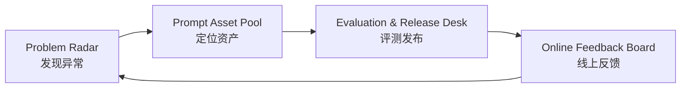
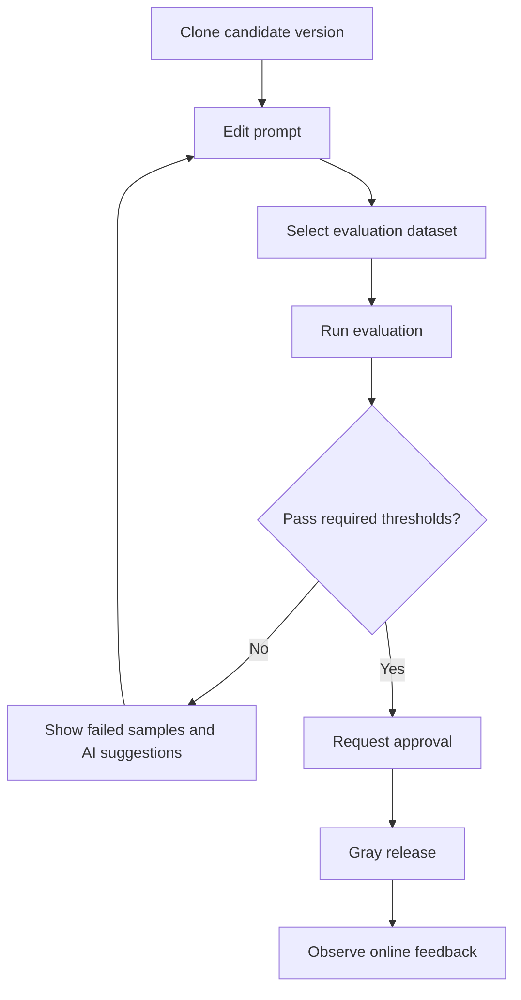

# AI Prompt Center UI Detail

Related page: `/ai/prompts`

Related implementation file: `src/views/ai/prompts/index.vue`

Related requirements:

- `docs/modules/route-feature-requirements.md`
- `docs/api/module-api-requirements.md`
- `docs/memory/decisions.md`

This document defines the UI direction for the Prompt Center redesign. The page should not be a simple three-column prompt editor. It should be a Prompt Ops Console for customer-service AI: find production issues, locate the affected prompt, evaluate a candidate version, publish safely, observe production results, and feed failures back into evaluation.

## 1. Product Direction

The Prompt Center has one job:

```text
发现问题 -> 定位 Prompt -> 编辑候选版本 -> 评测验证 -> 审批灰度 -> 线上观测 -> 回滚或沉淀样本
```

Keep only four useful blocks:

| Block | Purpose | Main User Question |
| --- | --- | --- |
| Problem Radar | Discover what needs attention | 哪些 Prompt 正在影响业务结果？ |
| Prompt Asset Pool | Locate and understand the prompt asset | 应该改哪一个 Prompt？它影响哪里？ |
| Evaluation & Release Desk | Test and publish a candidate version | 这个版本能不能上线？怎么安全上线？ |
| Online Feedback Board | Observe the production result | 上线后是否变好了？是否需要回滚？ |

Closed loop:



## 2. Overall Layout

Use a dense enterprise console layout, consistent with AI Ticket OS:

- Dark operational workspace.
- Cards use 8px radius or less.
- Information density should be high but scannable.
- AI-native status should be visible, but decorative visuals should stay secondary.
- The page should work as a dashboard plus workbench, not as a marketing page.

Recommended desktop layout:

```text
Prompt Center
+-- Top Command Bar
|   +-- Title, description, environment switch
|   +-- Search and filters
|   +-- Primary actions
+-- Problem Radar
+-- Prompt Asset Pool
+-- Evaluation & Release Desk
+-- Online Feedback Board
```

Recommended visual stacking:

```text
+----------------------------------------------------------------------------+
| Top Command Bar                                                            |
+----------------------------------------------------------------------------+
| Problem Radar                                                              |
| KPI strip + issue lanes + AI insight                                       |
+----------------------------------------------------------------------------+
| Prompt Asset Pool                                                          |
| Lifecycle lanes + prompt cards/table + dependency preview                  |
+-------------------------------------+--------------------------------------+
| Evaluation & Release Desk           | Online Feedback Board                |
| Candidate version, tests, approval  | Production metrics, alerts, rollback |
+-------------------------------------+--------------------------------------+
```

Viewport behavior:

| Viewport | Layout Strategy |
| --- | --- |
| 1920 x 1080 | Full layout. Evaluation and feedback can sit side by side in the lower row. |
| 1440 x 900 | Keep all four blocks. Reduce card copy and table columns. |
| 1366 x 768 | Keep the closed loop visible; allow the asset pool to use compact rows. |
| Below 1280 | Keep desktop minimum width and allow horizontal scroll if needed. This is an enterprise admin page. |

Spacing and sizing:

| Area | Recommendation |
| --- | --- |
| Page padding | 16px |
| Section gap | 16px |
| Card radius | 8px |
| Top command bar height | 72px to 96px |
| KPI card height | 76px to 88px |
| Problem lane height | 160px to 220px |
| Prompt asset row height | 72px to 88px |
| Lower workbench minimum height | 320px |

## 3. Top Command Bar

The top bar answers where the user is operating and what action they can take now.

Content:

| Element | UI Detail |
| --- | --- |
| Title | `提示词中心` or `Prompt Center`, 20px to 22px, 600 weight. |
| Description | `管理客服 AI 提示词的发现、评测、发布、观测和回滚闭环。` |
| Environment switch | Segmented control: `生产`, `灰度`, `预发`, `草稿`. |
| Global search | Search by prompt name, scenario, owner, variable, agent, workflow. |
| Filters | Business scenario, channel, owner, status, risk level, model. |
| Primary action | `运行评测`. |
| Secondary actions | `新建 Prompt`, `导入样本`, `发布记录`. |

Interaction:

- Changing environment refreshes all four blocks.
- Search highlights matched prompt cards and issue records.
- Active filters display as compact removable tags below the command bar.
- If the user has unsaved candidate changes, switching environment requires confirmation.

## 4. Block 1: Problem Radar

Purpose: make the page start from business problems, not from a raw prompt list.

### 4.1 Structure

```text
Problem Radar
+-- Health KPI Strip
+-- Issue Lanes
+-- AI Insight
```

Health KPI Strip:

| KPI | Example | Click Behavior |
| --- | --- | --- |
| 评测通过率 | 90.1%, -6.3% | Filter failed evaluation prompts. |
| 护栏触发 | 316, +8.4% | Open safety issue lane. |
| 转人工率 | 18.7%, +3.2% | Filter prompts linked to human takeover. |
| 差评关联 | 72, +12 | Open negative-feedback cases. |
| 灰度异常 | 4 | Filter gray releases needing attention. |

Issue lanes:

| Lane | Records |
| --- | --- |
| 合规风险 | Refund promise, privacy leakage, unauthorized guarantee. |
| 业务效果下降 | Resolution rate drop, repeat inquiry rise, CSAT drop. |
| 模型输出异常 | Hallucination, low confidence, missing citation. |
| 发布阻塞 | Evaluation failed, approval pending, gray release regression. |

Issue card fields:

| Field | UI Detail |
| --- | --- |
| Severity | Critical, High, Warning, Info tag. |
| Issue title | One-line title, max 36 Chinese characters. |
| Related prompt | Clickable prompt name and version. |
| Metric impact | Numeric delta, e.g. `合规通过率 -8.2%`. |
| Source | Online log, evaluation, complaint, QA sample, guardrail. |
| Suggested action | `进入评测`, `克隆版本`, `回滚`, `加入评测集`. |

### 4.2 Interaction

- Click an issue card to select the related prompt in Prompt Asset Pool.
- Click `进入评测` to prefill Evaluation & Release Desk with the affected prompt, failed samples, and suggested test set.
- Click `忽略` requires a reason and writes an audit record.
- Critical issues stay pinned until resolved, rolled back, or explicitly waived.

### 4.3 Empty and Loading States

| State | UI |
| --- | --- |
| Loading | KPI skeleton plus four lane skeletons. |
| No issues | Show stable health summary and shortcut to all production prompts. |
| No permission | Hide sensitive issue details and show permission request entry. |

## 5. Block 2: Prompt Asset Pool

Purpose: help users locate the exact prompt asset and understand its blast radius.

### 5.1 Structure

```text
Prompt Asset Pool
+-- Lifecycle tabs
+-- View switch: table / card / dependency
+-- Prompt assets
+-- Dependency preview
```

Lifecycle tabs:

```text
全部 / 草稿中 / 待评测 / 待审批 / 灰度中 / 生产中 / 需回滚 / 已归档
```

Recommended default: table view. Card view can be used for exploration. Dependency view can be a compact graph preview.

Table columns:

| Column | Width | UI Detail |
| --- | ---: | --- |
| Prompt | 260 | Name, scenario tag, short description. |
| Production Version | 120 | `v12`, release label, publish time tooltip. |
| Status | 100 | Draft, Testing, Pending Approval, Gray, Production, Rollback Needed. |
| Health | 120 | Score plus mini progress bar. |
| Risk | 100 | Low, Medium, High, Critical. |
| Calls | 100 | 7-day calls with trend. |
| Owner | 120 | Avatar/name/team. |
| Dependencies | 220 | Agent, workflow, channel, knowledge scope chips. |
| Last Change | 140 | Relative time plus operator tooltip. |
| Actions | 180 | Detail, clone, evaluate, diff, more. |

Card fields:

- Prompt name.
- Scenario and channel.
- Production version.
- Health score.
- Risk level.
- Last issue.
- Owner.
- Dependencies.
- Primary action based on state.

### 5.2 Prompt Health Passport

Every prompt should have a compact health passport shown in hover popover or detail drawer:

| Item | Meaning |
| --- | --- |
| Online calls | Last 7 days and trend. |
| Evaluation pass rate | Latest test set result. |
| Guardrail triggers | Safety incidents. |
| Human takeover impact | Whether this prompt increases handoff. |
| Complaint correlation | Negative feedback linked to this prompt. |
| Stable version | Last known good version. |

### 5.3 Dependency Preview

When a prompt is selected, show its usage impact:

```text
Prompt
+-- AI Agent: Refund Assistant, Complaint Assistant
+-- Workflow: Refund approval, VIP escalation
+-- Channel: Live chat, Email, Unified inbox
+-- Knowledge scope: Refund policy, Warranty policy
+-- Output consumer: Ticket summary, reply draft, risk classifier
```

Interaction:

- Clicking a dependency filters related assets where possible.
- High-risk shared prompts show an impact warning before cloning, publishing, or rollback.
- Dependency preview should be visible without opening a large detail page.

## 6. Block 3: Evaluation & Release Desk

Purpose: turn a prompt change into a tested and publishable candidate version.

### 6.1 Structure

```text
Evaluation & Release Desk
+-- Candidate Version Header
+-- Prompt Editor Summary
+-- Variable Simulator
+-- Evaluation Matrix
+-- Version Diff
+-- Release Controls
```

Candidate version header:

| Field | UI Detail |
| --- | --- |
| Current prompt | Prompt name and selected production version. |
| Candidate version | Draft version, e.g. `v13-draft`. |
| Change reason | Required before evaluation or release request. |
| Author | Current user. |
| Status | Draft, Evaluating, Passed, Failed, Pending Approval, Gray. |

Prompt editor summary:

- Do not make the lower block a giant full editor by default.
- Show a compact structured summary first: system instruction, user template, tools, output schema, variables.
- Provide `打开编辑器` to open a large editor drawer or full-page work surface.

Variable simulator:

| Variable | Example |
| --- | --- |
| Customer | VIP customer, new customer, complaint customer. |
| Ticket | Refund request, logistics delay, warranty claim. |
| Order | Paid, shipped, refunded, dispute. |
| Policy | Refund rule, warranty rule, compensation boundary. |
| Knowledge | Matched article, source confidence, citation requirement. |

Evaluation matrix:

| Metric | UI |
| --- | --- |
| 准确性 | Score, pass threshold, failed samples count. |
| 合规 | Score, risk terms, blocked outputs. |
| 语气 | Score, empathy, professional tone. |
| 引用质量 | Citation coverage and source confidence. |
| 解决率 | Expected first-contact resolution impact. |
| 回归风险 | Old scenarios broken by new version. |

Version Diff:

- Text diff: added, removed, changed instructions.
- Semantic diff: new promise, removed constraint, stronger tone, weaker citation requirement.
- Variable diff: new variable, removed variable, optional variable changed to required.
- Risk diff: safety boundary changed, compliance wording changed.

Release controls:

| Control | Detail |
| --- | --- |
| Run Evaluation | Primary button. Requires selected dataset. |
| Request Approval | Enabled only after required checks pass. |
| Gray Release | Select percentage, channel, customer segment, duration. |
| Promote to Production | Requires approval and gray result. |
| Rollback Target | Choose last stable version. |

### 6.2 Evaluation Flow



### 6.3 Interaction Rules

- `Request Approval` is disabled when required evaluation metrics fail.
- `Gray Release` is disabled without approval.
- Dangerous actions, including rollback and production promotion, require confirmation.
- AI-generated rewrite suggestions must show confidence and affected test samples.
- Failed samples can be added to an evaluation dataset from the same block.

## 7. Block 4: Online Feedback Board

Purpose: close the loop after release and make production results actionable.

### 7.1 Structure

```text
Online Feedback Board
+-- Production Trend
+-- A/B or Gray Result
+-- Exception Clusters
+-- Closed-loop Actions
```

Production trend cards:

| Metric | UI Detail |
| --- | --- |
| Satisfaction | Line trend plus version marker. |
| Human takeover | Trend, threshold, linked prompt version. |
| Repeat inquiry | Trend and affected scenario. |
| Guardrail trigger | Count, severity, latest sample. |
| Cost and latency | Optional but useful when model selection changes. |

A/B or gray result:

| Field | UI Detail |
| --- | --- |
| Variant A | Production version metrics. |
| Variant B | Candidate version metrics. |
| Traffic split | Percentage and segment. |
| Winner | Better, worse, inconclusive. |
| Recommendation | Promote, extend gray, rollback, retest. |

Exception clusters:

| Cluster | Example Action |
| --- | --- |
| 差评样本 | Add to evaluation set. |
| 合规拦截 | Open safety rule detail. |
| 低置信回复 | Open prompt diff and knowledge citation. |
| 转人工升高 | Link to affected scenario. |
| 重复失败 | Create issue in Problem Radar. |

Closed-loop actions:

- `加入评测集`
- `创建问题`
- `回滚版本`
- `继续灰度`
- `提升为稳定版本`
- `通知负责人`

### 7.2 Interaction Rules

- Version markers should appear on trend charts at release time.
- Clicking a chart anomaly opens related logs or samples.
- Rollback creates an audit event and reopens the issue in Problem Radar.
- Promoting a candidate to stable archives the previous candidate state but keeps history accessible.

## 8. Detail Drawers and Modals

Use drawers for detailed operational surfaces and modals for confirmation or short forms.

Recommended overlays:

| Overlay | Type | Width | Purpose |
| --- | --- | ---: | --- |
| Prompt Detail | Drawer | 720px to 920px | Prompt passport, versions, dependencies, audit. |
| Prompt Editor | Large drawer or route | 960px to 1200px | Structured prompt editing. |
| Evaluation Run Detail | Drawer | 860px | Dataset, samples, evaluator results. |
| Version Diff | Drawer | 860px | Text diff and semantic diff. |
| Approval Request | Modal | 720px | Change reason, risk summary, approvers. |
| Gray Release Config | Modal | 720px | Traffic, channel, segment, duration. |
| Rollback Confirm | Modal | 520px | Confirm target version and reason. |
| Audit Log | Drawer | 720px | Modification, approval, release, rollback history. |

Prompt editor sections:

```text
Prompt Editor
+-- Basic Info: name, scenario, owner, risk level
+-- System Instruction
+-- User Template
+-- Variables
+-- Tools and Knowledge Sources
+-- Output Schema
+-- Safety Constraints
+-- Save / Run Evaluation
```

## 9. Status Model

Prompt lifecycle statuses:

| Status | UI Tone | Main Action |
| --- | --- | --- |
| Draft | Gray | Continue editing. |
| Evaluating | Blue | View progress. |
| Evaluation Failed | Red | View failed samples. |
| Evaluation Passed | Green | Request approval. |
| Pending Approval | Amber | View approval. |
| Gray Release | Cyan | Observe feedback. |
| Production | Green | Clone, evaluate, monitor. |
| Rollback Needed | Red | Rollback or investigate. |
| Archived | Muted | View history. |

Issue severity:

| Severity | UI Tone | Rule |
| --- | --- | --- |
| Critical | Red | Blocks release and pins the issue. |
| High | Amber red | Requires owner confirmation. |
| Warning | Amber | Can be released with reason if policy allows. |
| Info | Blue or gray | Informational. |

## 10. Permissions

Recommended UI permission checks:

| Action | Permission |
| --- | --- |
| View prompt center | `ai:prompt:view` |
| Create or clone prompt | `ai:prompt:create` |
| Edit prompt draft | `ai:prompt:update` |
| Run evaluation | `ai:prompt:evaluate` |
| Request approval | `ai:prompt:approval` |
| Publish or gray release | `ai:prompt:publish` |
| Rollback | `ai:prompt:rollback` |
| View audit | `ai:prompt:audit` |

Disabled action copy should be explicit:

```text
无发布权限，请联系 AI Ops 管理员。
```

## 11. Example Copy and Data

Page description:

```text
管理客服 AI 提示词的发现、评测、发布、观测和回滚闭环，确保线上回复可控、可测、可追踪。
```

Problem examples:

| Issue | Related Prompt | Impact |
| --- | --- | --- |
| 退款回复合规通过率下降 | 退款安抚回复 v12 | 合规 -8.2% |
| VIP 投诉场景转人工升高 | VIP 升级判断 v7 | 转人工 +4.1% |
| 物流延迟回复引用缺失 | 物流延迟说明 v5 | 引用覆盖 -12.6% |
| 灰度版本差评升高 | 售后补偿建议 v9-gray | 差评 +17 |

Prompt examples:

| Prompt | Scenario | Version | Status | Health |
| --- | --- | --- | --- | --- |
| 退款安抚回复 | 退款 | v12 | Rollback Needed | 72 |
| VIP 升级判断 | 投诉 / VIP | v7 | Production | 88 |
| 物流延迟说明 | 售后 / 物流 | v5 | Evaluation Failed | 64 |
| 售后补偿建议 | 售后 | v9-gray | Gray Release | 81 |

AI insight example:

```text
AI 检测到「退款安抚回复 v12」在最近 24 小时的合规评测和线上护栏中同时下降，主要失败样本集中在“承诺退款到账时间”。建议克隆 v11 稳定版本，补充到账时效边界，并用退款争议评测集回放。
```

## 12. Component Split

Recommended first-phase components:

| Component | Responsibility |
| --- | --- |
| `PromptCenterPage` | Page container and orchestration. |
| `PromptCommandBar` | Search, filters, environment switch, top actions. |
| `PromptProblemRadar` | KPIs, issue lanes, AI insight. |
| `PromptAssetPool` | Lifecycle tabs, prompt table/card view, dependency preview. |
| `PromptEvaluationDesk` | Candidate version, evaluation matrix, release controls. |
| `PromptFeedbackBoard` | Production trends, gray result, exception clusters. |
| `PromptDetailDrawer` | Prompt passport, versions, dependencies, audit. |
| `PromptEditorDrawer` | Structured prompt editing. |
| `PromptVersionDiffDrawer` | Text and semantic diff. |
| `PromptApprovalModal` | Approval request. |
| `PromptRollbackModal` | Rollback confirmation. |

Minimum implementation tree:

```text
PromptCenterPage
+-- PromptCommandBar
+-- PromptProblemRadar
+-- PromptAssetPool
+-- PromptEvaluationDesk
+-- PromptFeedbackBoard
+-- PromptDetailDrawer
+-- PromptVersionDiffDrawer
+-- PromptApprovalModal
+-- PromptRollbackModal
```

## 13. Acceptance Checklist

| View | Acceptance Point |
| --- | --- |
| Default page | All four blocks are visible and the closed-loop relationship is clear. |
| Problem Radar | Issues can select a related prompt and trigger evaluation context. |
| Prompt Asset Pool | Prompt records show version, health, risk, owner, dependencies, and actions. |
| Evaluation Desk | Candidate version can show evaluation metrics, failed samples, diff, and release controls. |
| Feedback Board | Online metrics show version markers, exception clusters, and rollback/sample actions. |
| Empty state | No section is blank; each empty state explains why and offers a next action. |
| Loading state | Top bar renders first; sections use stable skeletons without layout jumps. |
| Permission state | Restricted actions are disabled with clear copy. |
| Risk state | Critical issues are visually distinct and cannot be silently ignored. |
| Encoding | Chinese copy renders correctly. The current mojibake in `src/views/ai/prompts/index.vue` must be fixed before or during implementation. |

## 14. Phase Plan

Phase 1: UI skeleton and mock data

- Replace the simplified prompt page with the four-block layout.
- Add mock data for issue cards, prompt assets, evaluation matrix, and feedback trends.
- Keep existing route and API integration boundary stable.

Phase 2: Operational detail

- Add prompt detail drawer, version diff drawer, approval modal, and rollback modal.
- Add dependency preview and prompt health passport.
- Add empty, loading, disabled, and risk states.

Phase 3: Real closed loop

- Connect real prompt list/detail, version list, variable config, scenario binding, test run, score result, and approval publish APIs.
- Feed online exception samples into evaluation datasets.
- Add audit records for publish, rollback, approval, and ignored issues.
