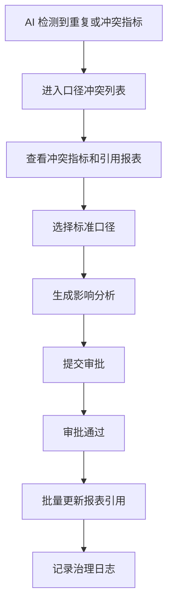

# BI 报表门户页完整切分文档

## 1. 页面定位

页面路径：`/analytics/bi`

页面名称：BI 报表

页面类型：报表门户型，不采用三栏工作台布局。

核心目标：

- 让用户快速找到报表、判断报表是否可信、打开报表查看数据。
- 支持报表订阅、导出、收藏、发布、权限与指标口径治理。
- 建立从“报表使用”到“异常发现”再到“治理处理”的闭环。

一句话定位：

> BI 报表页是企业客服数据资产的入口，负责报表发现、报表消费、报表交付和口径治理。

## 2. 目标用户

| 角色 | 主要诉求 | 页面能力 |
| --- | --- | --- |
| 运营主管 | 查看服务量、SLA、坐席效率、渠道表现 | 快速打开常用报表、保存筛选、订阅日报 |
| 数据分析师 | 管理报表资产、维护指标口径 | 新建报表、编辑配置、处理口径冲突 |
| 客服负责人 | 关注团队表现和异常趋势 | 查看推荐报表、下钻明细、导出结果 |
| 管理层 | 读取稳定的决策报表 | 收藏、订阅、查看可信度和更新时间 |
| 系统管理员 | 管理权限、审计导出行为 | 权限配置、导出记录、订阅任务状态 |

## 3. 页面信息架构

```mermaid
flowchart TD
  A["BI 报表门户"] --> B["顶部工具栏"]
  A --> C["资产健康概览"]
  A --> D["快捷入口区"]
  A --> E["报表列表区"]
  A --> F["报表详情页 / 详情抽屉"]
  A --> G["治理与任务弹层"]

  B --> B1["搜索报表 / 指标 / 负责人"]
  B --> B2["时间范围"]
  B --> B3["业务域"]
  B --> B4["租户 / 渠道 / 团队"]
  B --> B5["新建报表"]
  B --> B6["导出中心"]
  B --> B7["订阅中心"]

  C --> C1["报表总数"]
  C --> C2["活跃报表"]
  C --> C3["订阅任务"]
  C --> C4["导出请求"]
  C --> C5["口径冲突"]
  C --> C6["数据新鲜度"]

  D --> D1["推荐报表"]
  D --> D2["最近使用"]
  D --> D3["我收藏的"]
  D --> D4["我负责的"]
  D --> D5["异常报表"]

  E --> E1["报表表格"]
  E --> E2["视图切换：卡片 / 表格"]
  E --> E3["批量操作"]
  E --> E4["状态筛选"]

  F --> F1["报表预览"]
  F --> F2["工作簿页签"]
  F --> F3["筛选条件"]
  F --> F4["图表区"]
  F --> F5["明细数据"]

  G --> G1["新建 / 编辑报表"]
  G --> G2["订阅配置"]
  G --> G3["导出任务队列"]
  G --> G4["指标口径详情"]
  G --> G5["口径冲突处理"]
```



## 4. 首屏布局

采用“顶部工具栏 + 概览指标 + 快捷入口 + 报表列表”的传统门户结构。

```text
┌──────────────────────────────────────────────────────────────────────────────┐
│ 顶部工具栏                                                                   │
│ BI 报表  搜索框  时间范围  业务域  状态  负责人       新建报表 导出中心 订阅中心 │
├──────────────────────────────────────────────────────────────────────────────┤
│ 资产健康概览                                                                 │
│ 报表总数 | 活跃报表 | 订阅任务 | 导出请求 | 口径冲突 | 数据新鲜度               │
├──────────────────────────────────────────────────────────────────────────────┤
│ 快捷入口                                                                     │
│ 推荐报表         最近使用         我收藏的         我负责的         异常报表     │
├──────────────────────────────────────────────────────────────────────────────┤
│ 报表列表                                                                      │
│ 分类 Tabs：全部 / 运营 / SLA / 风险 / 坐席绩效 / 客户 / 自定义                │
│                                                                              │
│ 表格：报表名称 | 业务域 | 负责人 | 最近刷新 | 使用次数 | 可信度 | 状态 | 操作    │
└──────────────────────────────────────────────────────────────────────────────┘
```

## 5. 模块切分详情

### 5.1 顶部工具栏

用途：完成报表查找、全局筛选和高频操作。

组件内容：

| 区域 | 控件 | 说明 |
| --- | --- | --- |
| 页面标题 | `BI 报表` + 描述 | 描述控制在一行内，例如“统一管理报表、订阅、导出和指标口径” |
| 搜索框 | 输入框 | 支持搜索报表名称、指标名、客户名、负责人 |
| 时间范围 | 日期范围选择器 | 默认最近 30 天 |
| 业务域 | 下拉选择 | 全部、运营、SLA、风险、坐席、客户、渠道 |
| 状态 | 下拉选择 | 全部、草稿、待发布、已发布、异常、已下线 |
| 负责人 | 下拉 / 远程搜索 | 可选“我负责的” |
| 主按钮 | 新建报表 | 打开新建报表向导 |
| 次按钮 | 导出中心、订阅中心 | 打开对应弹层 |

交互规则：

- 搜索回车或点击查询后刷新快捷入口和报表列表。
- 时间范围影响所有报表使用统计，不直接改变报表本身定义。
- 点击“刷新”只刷新当前门户数据，不触发报表数据重跑。

### 5.2 资产健康概览

用途：用户进入页面后先判断报表资产是否健康。

建议指标：

| 指标 | 示例值 | 说明 | 点击行为 |
| --- | --- | --- | --- |
| 报表总数 | 128 | 当前可见报表数 | 筛选全部报表 |
| 活跃报表 | 86 | 近 30 天被打开过的报表 | 筛选活跃报表 |
| 订阅任务 | 947 | 运行中的订阅任务数 | 打开订阅中心 |
| 导出请求 | 72 | 今日导出任务数 | 打开导出队列 |
| 口径冲突 | 16 | 指标重复或公式不一致数量 | 打开口径冲突处理 |
| 数据新鲜度 | 97.8% | 按时刷新的数据集占比 | 筛选异常报表 |

视觉建议：

- 不做大屏风格，保持后台门户的稳定感。
- 指标卡高度紧凑，适合横向扫描。
- “口径冲突”“数据新鲜度异常”使用警示色，但不大面积铺红。

### 5.3 快捷入口区

用途：减少用户在海量报表里的查找成本。

入口类型：

| 入口 | 内容 | 推荐展示 |
| --- | --- | --- |
| 推荐报表 | 系统根据角色、使用频率和异常程度推荐 | 3-4 张横向小卡 |
| 最近使用 | 当前用户最近打开的报表 | 报表名 + 最近打开时间 |
| 我收藏的 | 用户收藏报表 | 报表名 + 收藏分组 |
| 我负责的 | 当前用户是 owner 的报表 | 报表名 + 状态 |
| 异常报表 | 刷新失败、订阅失败、口径冲突 | 报表名 + 异常原因 |

推荐报表卡片字段：

| 字段 | 示例 |
| --- | --- |
| 报表名称 | SLA 履约周报 |
| 业务域 | SLA |
| 可信度 | 96 |
| 最近刷新 | 10 分钟前 |
| 使用趋势 | 本周 +18% |
| 主操作 | 打开 |

### 5.4 报表列表区

用途：传统报表门户的核心资产列表。

列表上方：

- 分类 Tabs：全部、运营、SLA、风险、坐席绩效、客户、渠道、自定义。
- 视图切换：表格视图、卡片视图。
- 批量操作：批量订阅、批量导出、批量变更负责人、批量下线。

表格字段：

| 字段 | 说明 |
| --- | --- |
| 报表名称 | 支持点击进入详情 |
| 类型 | 仪表盘、明细报表、透视报表、订阅报表 |
| 业务域 | 运营、SLA、风险、客户等 |
| 负责人 | 报表 owner |
| 数据集 | 关联数据集名称 |
| 最近刷新 | 最新数据刷新时间 |
| 使用次数 | 近 30 天打开次数 |
| 可信度 | 数据新鲜度、口径一致性、刷新成功率综合分 |
| 状态 | 草稿、待发布、已发布、异常、已下线 |
| 操作 | 打开、订阅、导出、更多 |

行内状态：

| 状态 | 页面表现 |
| --- | --- |
| 已发布 | 绿色标签，可打开、订阅、导出 |
| 草稿 | 灰色标签，可编辑、预览、提交发布 |
| 待发布 | 蓝色标签，可查看审批状态 |
| 异常 | 橙色或红色标签，展示异常原因 |
| 已下线 | 灰色弱化，只允许查看历史 |

## 6. 报表详情切分

报表详情建议以“完整详情页或大尺寸抽屉”呈现。门户页不做三栏，详情进入后采用工作簿页签结构。

```text
┌──────────────────────────────────────────────────────────────────────────────┐
│ 报表详情头部                                                                  │
│ SLA 履约周报  已发布  可信度 96  最近刷新 10 分钟前                            │
│ 收藏 订阅 导出 分享 编辑 更多                                                   │
├──────────────────────────────────────────────────────────────────────────────┤
│ 页签：总览 | 趋势分析 | 渠道分布 | 坐席绩效 | SLA 明细 | 数据血缘 | 订阅记录       │
├──────────────────────────────────────────────────────────────────────────────┤
│ 筛选条件：时间、租户、渠道、团队、优先级、客户等级                              │
├──────────────────────────────────────────────────────────────────────────────┤
│ 当前页签图表区                                                                  │
│ KPI 卡片 + 趋势图 + 分布图 + 排名图 + 明细表                                     │
└──────────────────────────────────────────────────────────────────────────────┘
```

### 6.1 详情头部

字段：

| 字段 | 说明 |
| --- | --- |
| 报表名称 | 主标题 |
| 状态 | 已发布、草稿、异常等 |
| 可信度 | 综合分，点击查看计算依据 |
| 最近刷新 | 数据刷新时间 |
| 负责人 | 报表维护人 |
| 版本 | 当前发布版本 |
| 操作 | 收藏、订阅、导出、分享、编辑、更多 |

### 6.2 工作簿页签

推荐页签：

| 页签 | 内容 |
| --- | --- |
| 总览 | 核心 KPI、关键趋势、AI 摘要 |
| 趋势分析 | 时间序列、同比环比、异常点 |
| 渠道分布 | 电话、在线、邮件、短信、工单来源 |
| 坐席绩效 | 团队、个人、技能组表现 |
| SLA 明细 | 响应、解决、超时、补救动作 |
| 数据血缘 | 数据集、字段、指标、刷新任务 |
| 订阅记录 | 订阅人、频率、发送状态、失败原因 |

### 6.3 筛选区

筛选项：

- 时间范围
- 租户
- 渠道
- 团队
- 坐席
- 客户等级
- 工单类型
- 优先级
- SLA 状态

交互：

- 支持“保存为视图”。
- 支持“恢复默认筛选”。
- 筛选变更后图表和明细联动刷新。
- 保存视图后回到门户页，可在“保存视图”入口展示。

### 6.4 图表区

传统 BI 报表应覆盖以下图表类型：

| 类型 | 使用场景 |
| --- | --- |
| KPI 卡片 | 总量、达成率、增长率 |
| 折线图 / 面积图 | 趋势变化 |
| 柱状图 | 团队、渠道、类别对比 |
| 堆叠柱状图 | 多渠道构成 |
| 环形图 | 占比分析 |
| 漏斗图 | 工单流转、订阅转化 |
| 热力图 | 时段、区域、队列压力 |
| 明细表 | 可导出、可钻取的原始记录 |

图表交互：

- 点击图表维度后联动筛选明细表。
- 鼠标悬停展示数值、环比、同比。
- 异常点可点击查看 AI 归因。
- 明细表行可跳转到工单、客户、会话详情。

## 7. 弹层与闭环任务

### 7.1 新建报表向导

步骤：


字段：

| 步骤 | 字段 |
| --- | --- |
| 选择模板 | 空白报表、SLA 模板、运营日报、坐席绩效、风险分析 |
| 选择数据集 | 工单数据集、会话数据集、客户数据集、SLA 数据集 |
| 配置指标 | 指标、维度、排序、筛选、口径说明 |
| 配置图表 | 图表类型、图表标题、布局尺寸 |
| 权限订阅 | 可见范围、订阅人、发送频率 |
| 预览发布 | 发布说明、版本备注、发布审批 |

### 7.2 订阅配置弹窗

字段：

| 字段 | 说明 |
| --- | --- |
| 订阅名称 | 例如“客服运营日报” |
| 接收人 | 用户、角色、部门 |
| 频率 | 每日、每周、每月、自定义 |
| 发送时间 | 例如每天 09:00 |
| 文件格式 | PDF、Excel、图片 |
| 筛选快照 | 是否固定当前筛选条件 |
| 失败通知 | 失败时通知负责人 |

闭环：

订阅失败后进入“异常报表”，可查看失败原因并重新发送。

### 7.3 导出任务队列

字段：

| 字段 | 说明 |
| --- | --- |
| 任务编号 | 导出任务 ID |
| 报表名称 | 来源报表 |
| 发起人 | 当前用户或订阅任务 |
| 格式 | Excel、PDF、CSV |
| 状态 | 排队中、生成中、已完成、失败 |
| 创建时间 | 发起时间 |
| 完成时间 | 结束时间 |
| 操作 | 下载、重试、查看错误 |

### 7.4 指标口径详情

字段：

| 字段 | 说明 |
| --- | --- |
| 指标名称 | 例如“首次响应率” |
| 业务定义 | 业务可读说明 |
| 计算公式 | 分子、分母、过滤条件 |
| 数据来源 | 数据集、字段 |
| 更新频率 | 实时、小时、每日 |
| 负责人 | 指标 owner |
| 引用报表 | 哪些报表使用该指标 |
| 变更历史 | 公式和定义调整记录 |

### 7.5 口径冲突处理

闭环流程：



## 8. 数据模型建议

### 8.1 ReportItem

| 字段 | 类型 | 说明 |
| --- | --- | --- |
| id | string | 报表 ID |
| name | string | 报表名称 |
| type | string | 仪表盘、明细报表、透视报表 |
| domain | string | 业务域 |
| owner | string | 负责人 |
| datasetName | string | 数据集 |
| status | string | 状态 |
| trustScore | number | 可信度 |
| refreshTime | string | 最近刷新 |
| usageCount | number | 近 30 天使用次数 |
| subscriptionCount | number | 订阅人数 |
| hasMetricConflict | boolean | 是否存在口径冲突 |
| tags | string[] | 标签 |

### 8.2 MetricDefinition

| 字段 | 类型 | 说明 |
| --- | --- | --- |
| id | string | 指标 ID |
| name | string | 指标名称 |
| definition | string | 业务定义 |
| formula | string | 计算公式 |
| dataset | string | 数据集 |
| owner | string | 负责人 |
| updateFrequency | string | 更新频率 |
| reportRefs | string[] | 引用报表 |
| conflictLevel | string | 无、轻微、严重 |

### 8.3 SubscriptionTask

| 字段 | 类型 | 说明 |
| --- | --- | --- |
| id | string | 订阅任务 ID |
| reportId | string | 报表 ID |
| name | string | 订阅名称 |
| receivers | string[] | 接收人 |
| frequency | string | 频率 |
| sendTime | string | 发送时间 |
| format | string | 文件格式 |
| status | string | 正常、失败、暂停 |
| lastRunTime | string | 最近执行 |
| lastError | string | 最近错误 |

## 9. 权限与操作

| 操作 | 权限建议 |
| --- | --- |
| 查看报表 | `analytics:bi:view` |
| 新建报表 | `analytics:bi:create` |
| 编辑报表 | `analytics:bi:update` |
| 发布报表 | `analytics:bi:publish` |
| 导出报表 | `analytics:bi:export` |
| 管理订阅 | `analytics:bi:subscribe` |
| 管理指标口径 | `analytics:bi:metric` |
| 处理口径冲突 | `analytics:bi:governance` |

## 10. 页面状态

| 状态 | 页面表现 |
| --- | --- |
| 加载中 | 指标卡和列表使用骨架屏 |
| 无数据 | 展示“暂无报表”，提供新建报表按钮 |
| 搜索无结果 | 展示搜索条件和重置筛选按钮 |
| 报表异常 | 行内展示异常标签，可打开异常详情 |
| 导出失败 | 导出队列展示失败原因和重试按钮 |
| 订阅失败 | 订阅中心展示失败原因和重新发送 |
| 无权限 | 操作按钮禁用，并展示权限说明 |

## 11. 视觉与交互原则

- 页面是传统企业 BI 门户，不做三栏堆叠。
- 首屏重点是“找报表”和“判断报表健康”。
- 图表预览放在报表详情，不抢门户首页空间。
- 卡片只用于推荐报表、快捷入口和健康概览。
- 报表资产主区域优先使用表格，方便排序、筛选、批量操作。
- 详情页使用工作簿页签，符合传统 BI 用户习惯。
- 所有导出、订阅、口径冲突都要能回到任务状态，形成闭环。

## 12. 验收标准

页面完成后应满足：

- 用户能在 10 秒内找到常用报表。
- 用户能看到报表是否最新、是否可信、是否存在口径冲突。
- 用户能打开报表详情并通过页签查看不同分析视角。
- 用户能保存筛选视图，并在门户快捷入口再次使用。
- 用户能订阅报表，并查看订阅执行状态。
- 用户能发起导出，并在导出队列查看进度、下载或重试。
- 用户能查看指标口径，并处理口径冲突。
- 异常报表、失败导出、失败订阅都有明确负责人和下一步动作。

## 13. 推荐第一期实现范围

第一期建议先做门户闭环，不急着做复杂拖拽设计器。

优先实现：

1. 顶部工具栏。
2. 资产健康概览。
3. 快捷入口区。
4. 报表表格。
5. 报表详情页签。
6. 订阅配置弹窗。
7. 导出任务队列。
8. 指标口径详情抽屉。

第二期再做：

1. 图表拖拽设计器。
2. 数据血缘图。
3. 指标冲突自动合并。
4. 报表发布审批流。
5. AI 自动生成报表草稿。
