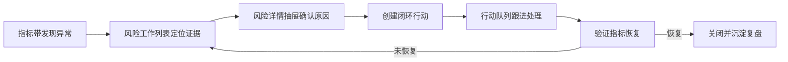

# 数据驾驶舱产品详情文档

## 1. 核心判断

数据驾驶舱不是报表墙，也不是 KPI 卡片集合。它应该更像一个运营控制台：用少量指标判断局面，用工作列表定位风险，用行动队列完成闭环。

页面保持 3 个核心对象：

- 健康总览：看整体是否正常。
- 风险指挥：看哪里异常、证据是什么、下一步去哪里处理。
- 闭环行动：看谁负责、处理到哪、指标是否恢复。

## 2. 去卡片化原则

为避免页面出现明显模板化和 AI 风格，第一期不采用大量独立卡片堆叠。

推荐表达：

- 顶部用一条横向指标带，而不是 5 个大卡片。
- 风险区用工作列表、分组表格、优先级标签和证据列，而不是风险卡片墙。
- 行动区用状态队列、紧凑列表和进度条，而不是行动卡片网格。
- 详情信息放进抽屉，用分段信息、时间线、关联表格表达。
- 大屏入口保留为工具动作，不把当前页面做成装饰性大屏。

限制使用：

- 不做大面积渐变背景。
- 不做多层浮动卡片。
- 不做满屏圆角摘要块。
- 不做“AI 建议卡”“智能洞察卡”等孤立模块。
- 不使用无业务含义的光效、装饰线和炫酷图表。

允许使用：

- 少量紧凑指标单元。
- 表格行、列表行、状态条、进度条、标签、时间线。
- 抽屉、弹窗、分段控件、筛选器。
- ECharts 只用于必要趋势，不作为首屏主体。

## 3. 页面闭环



## 4. 三块结构

### 健康总览

形态：横向指标带。

内容：

- 综合健康分
- 今日服务量
- SLA 达成率
- 队列压力
- AI ROI

每个指标只保留：

- 指标名
- 当前值
- 变化值
- 影响维度
- 风险数量

交互：

- 点击指标后筛选风险工作列表。
- 异常指标只用状态色和短标签表达，不展开成大卡片。

### 风险指挥

形态：工作列表。

内容：

- SLA 风险
- 服务压力风险
- AI 质量风险

列表列建议：

| 列 | 说明 |
| --- | --- |
| 优先级 | 紧急 / 高 / 中 |
| 风险对象 | 客户、渠道、团队或业务类型 |
| 影响指标 | SLA、积压、转人工率、失败率等 |
| 证据 | 工单数量、时段、团队、业务类型 |
| 建议动作 | 一句话动作 |
| 入口 | 工单、SLA、风险、监控、AI 模型 |

交互：

- 点击行打开风险详情抽屉。
- 从详情抽屉创建行动。
- 已创建行动的风险行显示行动状态，避免重复派发。

### 闭环行动

形态：右侧行动队列。

状态：

```text
待派发 -> 处理中 -> 待验证 -> 已关闭
```

行动行建议：

| 信息 | 说明 |
| --- | --- |
| 动作 | 当前要做什么 |
| 来源风险 | 从哪条风险创建 |
| 负责人 | 谁处理 |
| 截止时间 | 什么时候必须处理 |
| 进度 | 0-100% |
| 验证指标 | 用什么判断恢复 |

规则：

- 未设置负责人不能进入处理中。
- 未设置验证指标不能进入待验证。
- 未恢复不能关闭，只能回到处理中或重新进入风险列表。

## 5. 第一版验收

- 页面主体不是卡片墙。
- 首屏只有一条指标带、一个风险工作列表、一个行动队列。
- 风险至少能看到影响指标和证据。
- 行动至少能看到负责人、截止时间、进度和验证指标。
- 任一高风险都能被创建为行动。
- 任一行动关闭前都要经过恢复验证。

